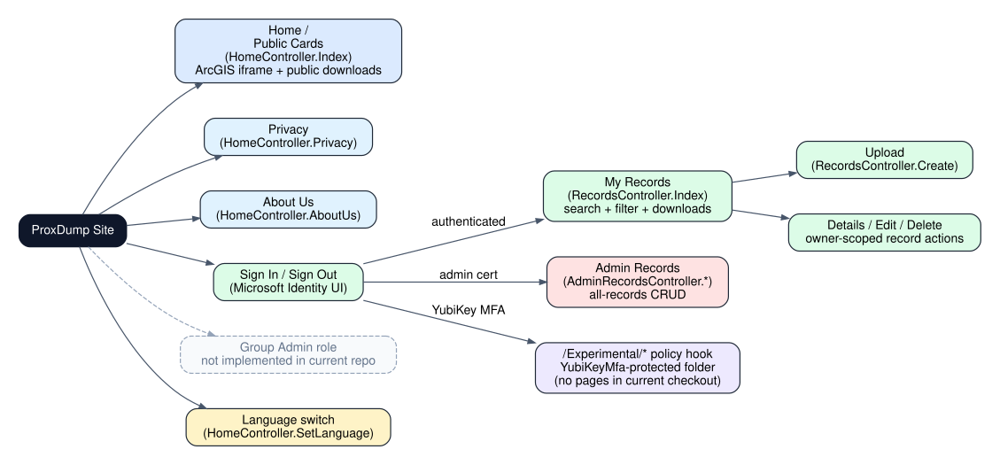
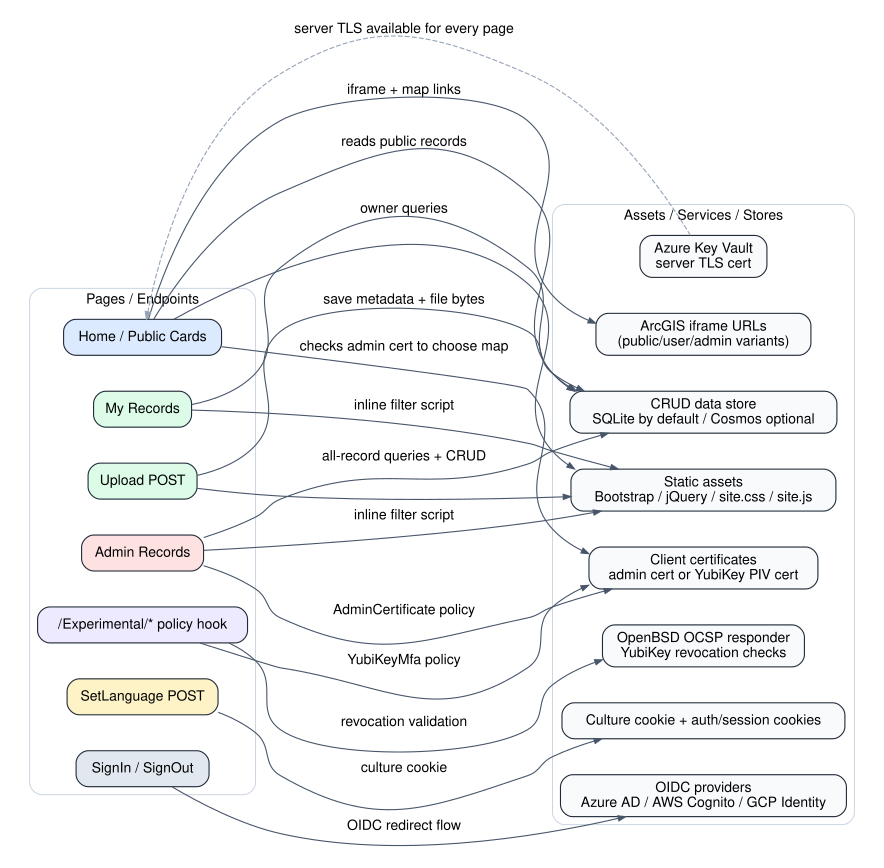
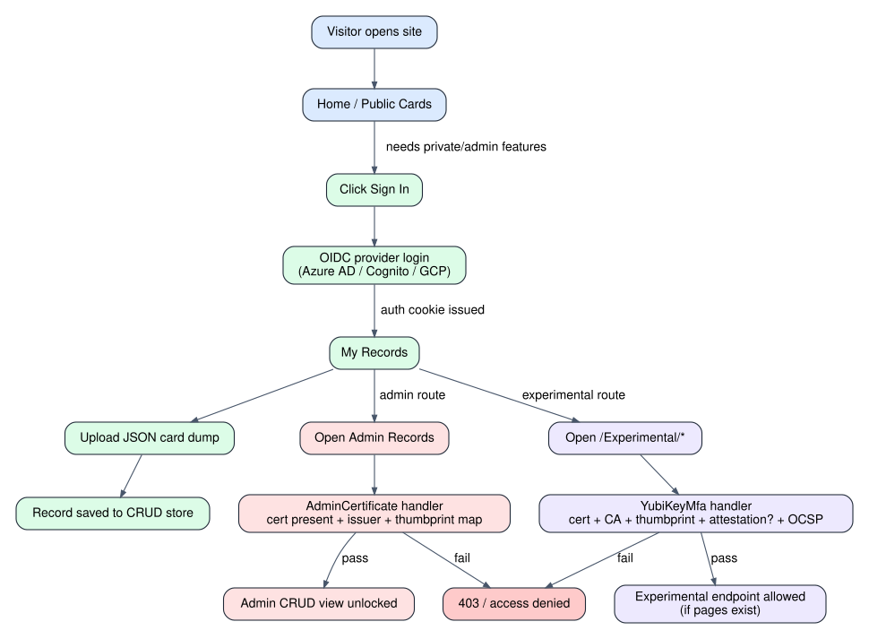
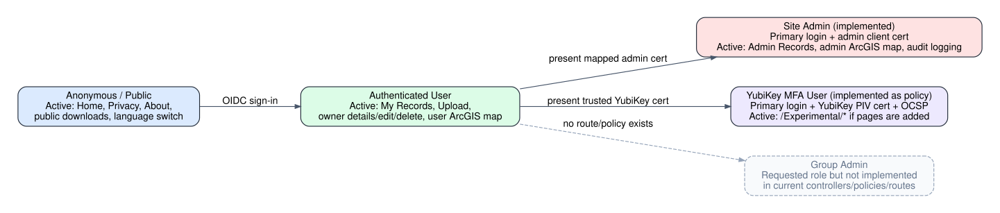
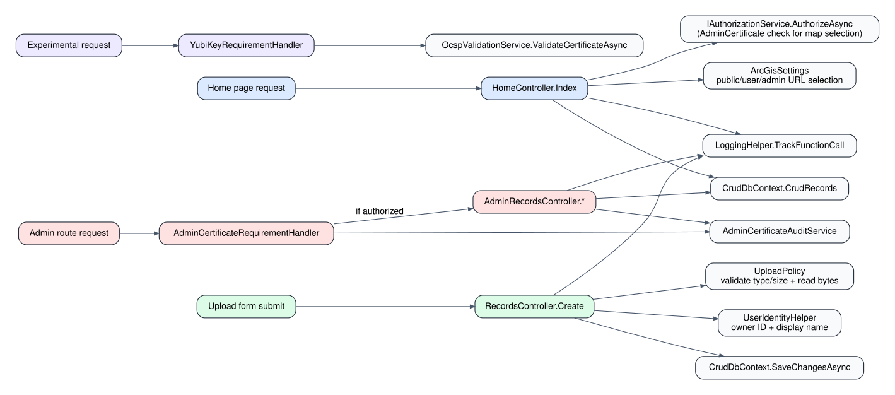
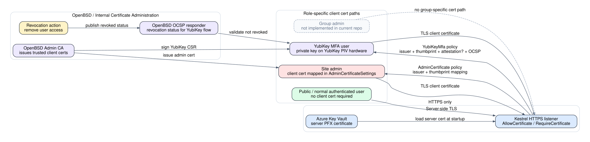
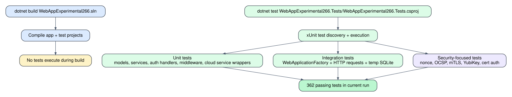

# Site Features, Roles, Flows, and Certificate Architecture Guide (en-US)

This guide documents the current structure of the site, the roles that are actually wired into the repository, the pages and assets those roles activate, the most common request flows, the certificate-authority processes behind privileged access, and how the automated tests interact with the application.

> **Current-scope note:** The repository currently implements **public**, **authenticated user**, **site admin (admin certificate)**, and **YubiKey MFA policy** flows. A dedicated **group admin** role is **not implemented in the current checkout**, and the `/Experimental/*` YubiKey policy hook exists even though no Razor Pages currently live under that folder.

## Feature summary

- Public visitors can browse public card dumps, open ArcGIS maps, switch language, and download public files.
- Authenticated users can sign in through an OIDC provider and manage their own records.
- Site admins must pass the normal login flow **and** present a mapped admin client certificate to access the admin-records surface.
- YubiKey MFA is modeled as a second factor for `/Experimental/*`: a signed-in user must also present a trusted YubiKey PIV certificate and pass OCSP validation.
- The app can integrate with Azure Key Vault, Cosmos DB, Blob Storage, AWS services, and GCP services through feature flags.
- Tests are run with `dotnet test`; they are not executed during plain compilation.

## Role inventory

| Role | Implemented now | Gate | Main active pages | Main assets/services activated |
|---|---|---|---|---|
| Public visitor | Yes | None | Home, Privacy, About, public downloads | ArcGIS public URL, CRUD read for public rows, static assets |
| Authenticated user | Yes | OIDC login (Azure AD, AWS Cognito, or GCP Identity) | My Records, Upload, owner Details/Edit/Delete | Auth cookie, CRUD owner queries, inline filters, user ArcGIS URL |
| Site admin | Yes | OIDC login + `AdminCertificate` policy | Admin Records CRUD | Client certificate, audit logging, full CRUD, admin ArcGIS URL |
| YubiKey MFA user | Policy only | OIDC login + `YubiKeyMfa` policy | `/Experimental/*` if pages are added | YubiKey PIV certificate, OCSP, optional attestation checks |
| Group admin | No | Not implemented | None | None |

## Diagram 1 — whole-site structure

The site surface is centered on three implemented controller areas:

- `HomeController` for public content and role-based map selection.
- `RecordsController` for owner-scoped CRUD actions after sign-in.
- `AdminRecordsController` for admin-scoped CRUD actions after both primary login and certificate validation.

The repo also wires a YubiKey policy to `/Experimental/*`, but there are no Razor Pages under `Pages/Experimental` in this checkout.

## Page and route inventory

| Route or surface | Access | Core code path | What it does |
|---|---|---|---|
| `/` | Public | `HomeController.Index` | Lists public records and chooses a public/user/admin ArcGIS map URL |
| `/Privacy`, `/Home/Privacy` | Public | `HomeController.Privacy` | Static privacy page |
| `/AboutUs`, `/Home/AboutUs` | Public | `HomeController.AboutUs` | Static about page |
| `POST /Home/SetLanguage` | Public | `HomeController.SetLanguage` | Persists culture choice in a cookie |
| `/Records` | Authenticated user | `RecordsController.Index` | Lists the current user’s records |
| `/upload` | Authenticated user | `RecordsController.Create` | Uploads a JSON card dump and metadata |
| `/Records/Details/{id}` | Owner/public read rules | `RecordsController.Details` | Shows one record |
| `/Records/Edit/{id}` | Owner only | `RecordsController.Edit` | Updates title/description |
| `/Records/Delete/{id}` | Owner only | `RecordsController.Delete` | Removes a record |
| `/Records/Download/{id}` | Public or authorized | `RecordsController.Download` | Downloads file content |
| `/AdminRecords/*` | Site admin | `AdminRecordsController.*` | Full-record CRUD and admin search/filter |
| `/Account/SignIn`, `/Account/SignOut` | Public/authenticated | Microsoft Identity UI | Starts or ends the primary login session |
| `/Experimental/*` | YubiKey MFA policy | Razor Pages convention | Reserved for second-factor protected pages |

## Diagram 2 — which pages interact with which assets

Key page-to-asset relationships:

| Page | Asset or external dependency | Purpose |
|---|---|---|
| Home | ArcGIS iframe URL | Chooses public, user, or admin map based on auth and admin-certificate result |
| Home | CRUD store | Reads up to 50 public records |
| Records pages | CRUD store | Reads or writes owner-scoped records |
| Records/Admin views | Inline JavaScript + static assets | Client-side table filtering and layout |
| Admin Records | Client certificate + audit service | Unlocks admin surface and records access attempts |
| Sign-in UI | OIDC provider | Establishes the primary identity |
| `/Experimental/*` | YubiKey certificate + OCSP responder | Enforces a second factor when the folder is used |
| Every HTTPS request | Azure Key Vault server certificate (optional feature) | Supplies the TLS server identity to Kestrel |

## Diagram 3 — common event flows

The most common user journeys are:

1. **Browse public content** → open the home page → see public records and the public ArcGIS map.
2. **Sign in and upload** → complete OIDC login → open My Records → upload a JSON file → write metadata and file bytes to the CRUD store.
3. **Enter the admin surface** → sign in → request `/AdminRecords` → pass `AdminCertificateRequirementHandler` → unlock full CRUD.
4. **Enter a YubiKey-protected route** → sign in → request `/Experimental/*` → pass YubiKey issuer, thumbprint, optional attestation, and OCSP checks.

## Diagram 4 — role activation state model

This role model reflects what the current code actually activates:

- **Anonymous** users only get public content.
- **Authenticated** users unlock owner-scoped CRUD pages.
- **Site admins** are a stricter state on top of authenticated users and require a mapped certificate.
- **YubiKey MFA users** are another stricter state on top of authenticated users and are intended for `/Experimental/*`.
- **Group admin** is a requested documentation concept, but there is no route, policy, or handler for it in the repository.

## Diagram 5 — what programs and functions activate during key interactions

The main request paths activate these application components:

| Interaction | Main controller/function path | Supporting services/functions |
|---|---|---|
| Open home page | `HomeController.Index` | `LoggingHelper.TrackFunctionCall`, `CrudDbContext.CrudRecords`, `IAuthorizationService.AuthorizeAsync`, `ArcGisSettings` |
| Upload record | `RecordsController.Create` | `UploadPolicy`, `UserIdentityHelper`, `CrudDbContext.SaveChangesAsync` |
| Browse own records | `RecordsController.Index` | `UserIdentityHelper.GetStableUserId`, `CrudDbContext` |
| Open admin pages | `AdminCertificateRequirementHandler` then `AdminRecordsController.*` | `AdminCertificateAuditService`, `CrudDbContext` |
| Open YubiKey-protected route | `YubiKeyRequirementHandler` | `OcspValidationService`, `YubiKeySettings`, TLS client certificate chain |
| Client-side filtering | `Views/Records/Index.cshtml` and `Views/AdminRecords/Index.cshtml` inline scripts | Bootstrap, jQuery, nonce-bearing script tags when CSP is enabled |

## Diagram 6 — certificate authority and YubiKey workflow

The certificate architecture splits into two major trust paths:

### Server certificate path

- The site can pull its **server TLS certificate** from **Azure Key Vault** at startup.
- Kestrel installs that server certificate for HTTPS.
- Every browser session depends on this server-side TLS identity.

### Privileged client-certificate path

- **Site admins** present a client certificate that must come from an allowed issuer and map to the signed-in admin’s configured thumbprint.
- **YubiKey MFA users** present a client certificate backed by a private key generated on YubiKey PIV hardware.
- The **OpenBSD admin CA** can sign YubiKey CSRs and operate the **OCSP responder** used during YubiKey validation.
- Revocation is especially important for the YubiKey flow because the app checks OCSP status during protected requests.

### Role-specific certificate expectations

| Role | Client certificate required | Validation path |
|---|---|---|
| Public | No | Server TLS only |
| Authenticated user | No | OIDC login only |
| Site admin | Yes | `AdminCertificateSettings.AllowedIssuers` + mapped thumbprint |
| YubiKey MFA user | Yes | Allowed CA issuer + optional CA thumbprint + optional attestation + OCSP |
| Group admin | No implementation | No current validation path |

## Diagram 7 — how tests interact with the site and when they run

The current repository behavior is:

- `dotnet build WebAppExperimental266.sln` compiles the application and test projects, but **does not run tests**.
- `dotnet test WebAppExperimental266.Tests/WebAppExperimental266.Tests.csproj` compiles as needed, discovers xUnit tests, and then runs them.
- Integration tests use `WebApplicationFactory<Program>` and a temporary SQLite database so they can send real HTTP requests through the app pipeline.

### Test coverage map

| Test area | What it exercises |
|---|---|
| Models tests | Configuration objects, defaults, validation helpers |
| Service tests | Auth handlers, OCSP logic, nonce services, cloud wrapper services |
| Extension tests | mTLS registration and pipeline ordering |
| Controller authorization tests | Required authorization attributes and policy usage |
| Integration tests | Home/Privacy routes, service registration, security headers, app startup |
| Security-focused tests | mTLS, YubiKey, admin certificate, nonce, OCSP behavior |

### Current timing answer

The automated tests run **during `dotnet test`**, not during a plain `dotnet build`. In the current validation run for this task, the repository passed **362 tests**.

## Operational observations and gaps

- The repository contains a strong certificate-driven admin and YubiKey story, but **group-admin-specific flows are not yet implemented**.
- `/Experimental/*` is already reserved for YubiKey MFA, so future feature work can attach new Razor Pages there without redesigning the auth model.
- The home page is the clearest page-to-asset hub because it combines database reads, authorization-sensitive ArcGIS selection, and public downloads.
- The admin views and user views both ship inline filter scripts, so CSP/nonce behavior matters for these pages when nonce services are enabled.

## Files most relevant to these diagrams

- `WebAppExperimental266/Program.cs`
- `WebAppExperimental266/Controllers/HomeController.cs`
- `WebAppExperimental266/Controllers/RecordsController.cs`
- `WebAppExperimental266/Controllers/AdminRecordsController.cs`
- `WebAppExperimental266/Extensions/ServiceCollectionExtensions.cs`
- `WebAppExperimental266/Extensions/CrudAndAdminExtensions.cs`
- `WebAppExperimental266/Services/AdminCertificateRequirementHandler.cs`
- `WebAppExperimental266/Services/YubiKeyRequirementHandler.cs`
- `WebAppExperimental266/Services/CrudRecordAuthorizationHandler.cs`
- `WebAppExperimental266/Views/Shared/_Layout.cshtml`
- `WebAppExperimental266/Views/Home/Index.cshtml`
- `WebAppExperimental266/Views/Records/Index.cshtml`
- `WebAppExperimental266/Views/AdminRecords/Index.cshtml`
- `WebAppExperimental266.Tests/Integration/ApplicationIntegrationTests.cs`
- `WebAppExperimental266.Tests/Integration/MtlsIntegrationTests.cs`
- `docs/YUBIKEY_OPENBSD_ADMIN_GUIDE.md`
